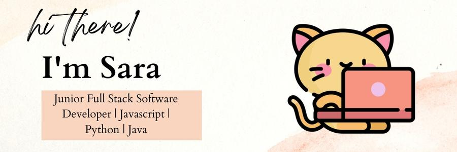

# Welcome to my Github Profile!

I'm a Junior Full-stack Software Developer and dedicated learner, recently completing CodeClan's flagship 16-week Software Development course and gaining an SQA Professional Development Award. I draw on over five years of professional experience in the healthcare sector and bring the management, coaching, quality improvement and soft skills I learned there to my new career in tech.
Some languages, frameworks and databases I enjoy working with include Javascript with React, Python with Flask, Java with Spring and a combination of both SQL and none SQL databases. 

## Find me on LinkedIn :smiley:: 

- My linkedIn: www.linkedin.com/in/sara-q 
